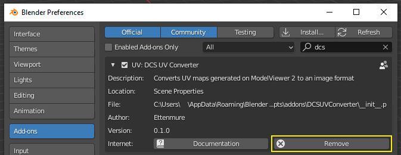
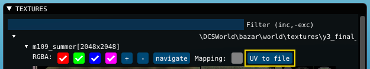
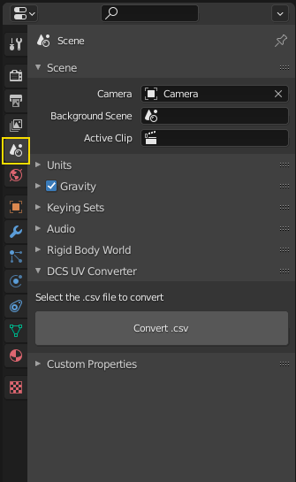
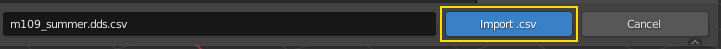
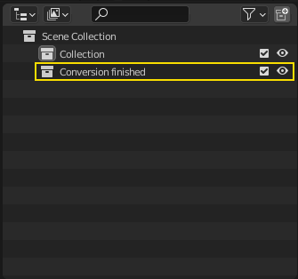

# DCS UV Map Converter Tool

This Blender Add-on converts UV maps generated on ModelViewer 2 to an image format.

## Installation

### Prerequisites

DCS 2.7, older versions can't generate the UV map.

Download and install Blender 2.92.0 from https://www.blender.org/download/

Download the latest release of the Add-on from https://github.com/Ettenmure/dcs-uv-converter/releases

### Installing the Add-on in Blender

In Blender, on the top left of the screen go to Edit > Preferences.

Open the Add-ons menu and click "Install", locate the previously downloaded "DCSUVConverter.zip" and click "Install Add-on".

Next, click on the checkbox to the left of the Add-on name to active it. Exit Blender.

### Updating from an older version

If you have an older version of the Add-on already installed, you should remove the old one first and then install the new one.

## Usage

### Exporting the UV map in Model Viewer

On the Model Viewer, load the model of your choosing.

On the textures panel, expand the texture that you want to generate a UV map for.

Click "UV to file", save the generated .csv file on your hard drive. This file contains the UV map data and will used in the next step.

### Converting the UV map to an image in Blender

Open a new Blender file. Don't use an existing one, the conversion process will delete every object on the scene.

On the Properties editor, at the right of the screen, change to the "Scene" tab.

Here you should see an entry called "DCS UV Converter", expand it to reveal the "Convert .csv" button and the "double texture resolution" checkbox.
Activating the checkbox will double the resolution of the generated UV map but it will also slow down the conversion process.

Click the grey "Convert .csv" button. A new window will open asking you to locate on your hard drive the .csv file that you previously created.
Select it and press the blue "Import .csv" button.

The conversion process has now begun, this can last from seconds to minutes depending on the complexity of the UV map and your computer hardware. 
Do not exit blender while it's running.

Once it finishes you will be notified on the outliner editor, at the top right of the screen, with a new collection appearing called "Conversion finished".

The conversion process has now finished, exit Blender.

The generated UV map is an image in .png format that will be located at the same folder as the .csv. Its name is the same as that of the .csv but with "_UV" added at the end.

## Troubleshooting

**The Add-on fails to install**

- Try a manual installation. Extract the .zip file and move the folder named "DCSUVConverter", which contains "\_\_init\_\_.py", to:

  C:\Users\\%USERNAME%\AppData\Roaming\Blender Foundation\Blender\2.92\scripts\addons

  If you have never installed an Add-on before you might not have the "scripts" or "addons" folders and you will have to create them manually.

  Next open Blender, or refresh the menu if it was already open, and on the Add-ons menu search for DCS.
  Activate the Add-on by clicking on the checkbox to the left of the Add-on name.

**The Add-on is installed but there is no "DCS UV Converter" at the scene tab**

- The Add-on might not have been activated. Confirm that the checkbox to the left of the Add-on name in the Add-ons menus is active.
Also review the documentation for Blender Add-ons:
https://docs.blender.org/manual/en/latest/editors/preferences/addons.html

## Planned features

These have not been implemented yet but are planned for later releases:

- Batch conversion
- Additional image export options
